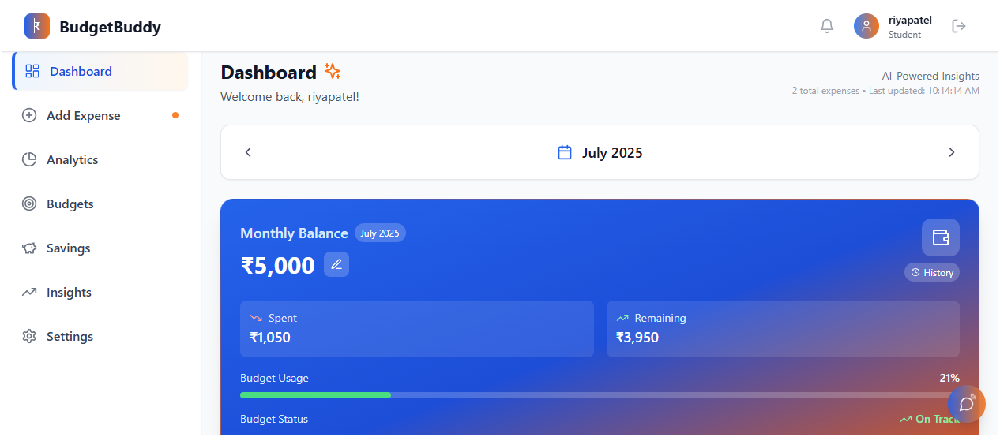
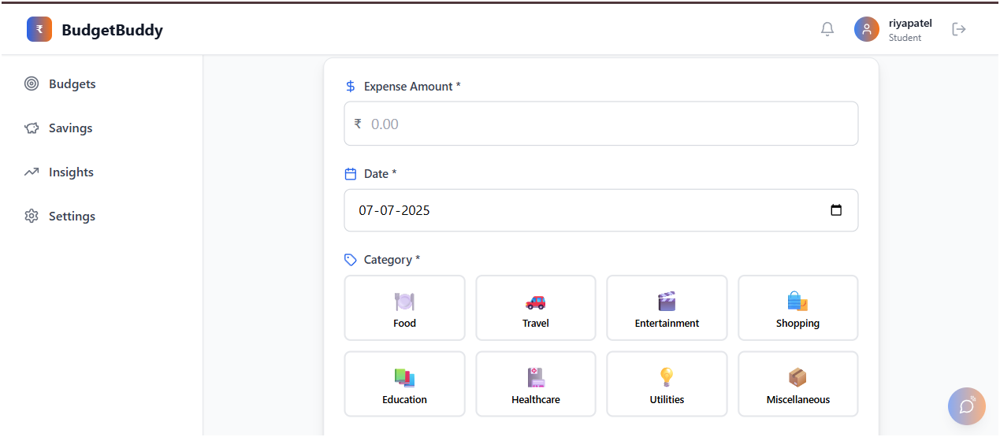
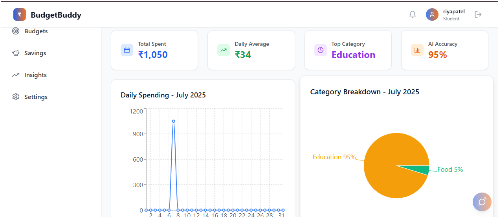
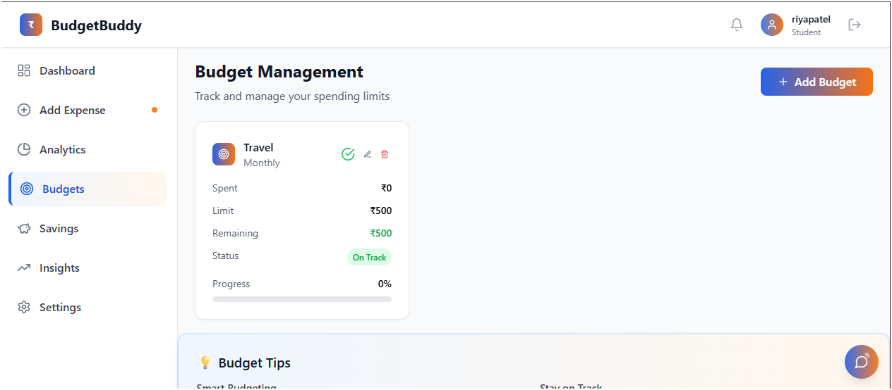
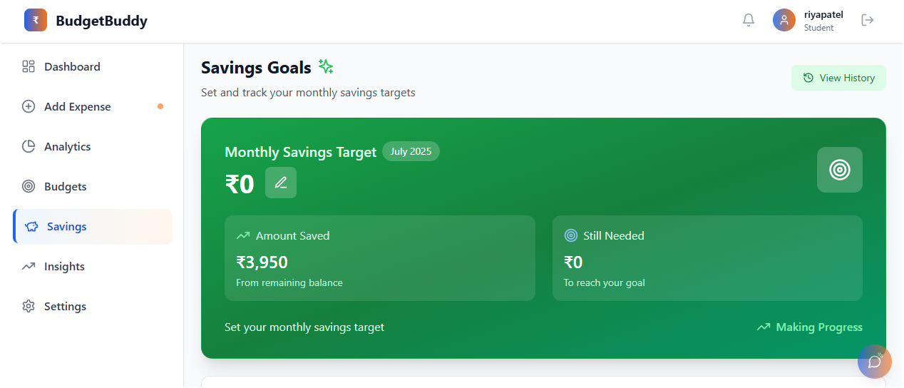

# 🎓💰 BudgetBuddy – AI-Powered Student Expenses Platform

BudgetBuddy is a modern, AI-powered web application built specifically for college students to manage their monthly budgets and track expenses effortlessly. With intuitive dashboards, smart analytics, and intelligent spending insights, BudgetBuddy empowers students to take control of their finances, avoid overspending, and build healthy money habits during their studies.

---

## ✨ Features

- **Student-Centric Dashboard**
  - See your monthly balance, total spent, and remaining funds in real time.
- **Add Expenses Easily**
  - Quickly log expenses with amount, category, date, and notes.
- **Budgets Management**
  - Set monthly budgets and manage spending by category.
- **Analytics & Trends**
  - Visualize where your money goes with dynamic charts and summaries.
- **Savings Goals**
  - Track your progress toward saving targets.
- **AI-Powered Insights**
  - Receive smart recommendations and warnings (e.g., "You're spending 30% more on food this month.")
- **Settings & Customization**
  - Tailor the platform to your needs and preferences.

---

## 🌐 Live Demo

👉 **Try it here:** [Live BudgetBuddy](https://elaborate-pothos-02b446.netlify.app/)

---

## 🖥️ Pages & Navigation

- **Dashboard:** Overview of your finances.
- **Add Expense:** Record expenses with details.
- **Analytics:** Spending trends and category summaries.
- **Budgets:** Manage and adjust monthly budgets.
- **Savings:** Monitor your saving goals.
- **Insights:** Get AI recommendations.
- **Settings:** Configure your account and preferences.

Dashboard | Add Expense | Analytics | Budgets | Savings | Insights | Settings

## 📸 Screenshots

| Page           | Screenshot                          |
|----------------|-------------------------------------|
| Dashboard      |  |
| Add Expense    |  |
| Analytics      |  |
| Budgets        |  |
| Savings        |  |

📽️ **Watch Demo Video**

> 📺 Click the thumbnail above to watch the video on YouTube.

