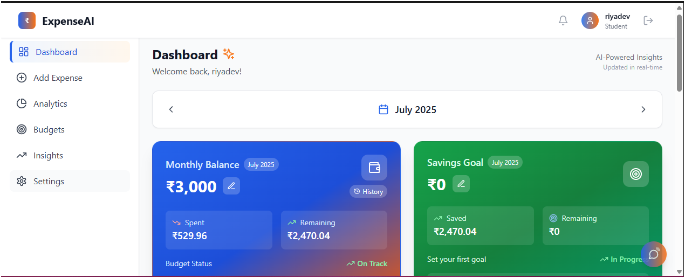
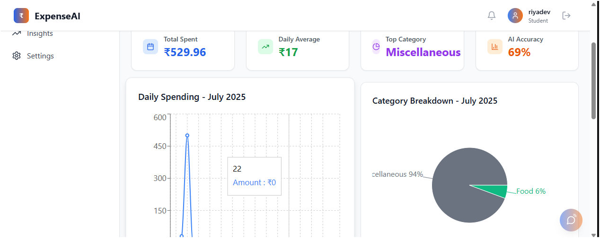

# 🎯 Project Title: AI-Powered Student Expense Manager

This web application is designed to help students efficiently manage their finances. It simplifies expense tracking, budgeting, and savings insights with the help of AI, making money management smart and stress-free.

---

## 🚀 Live Demo

🔗 **Try it now**: [https://elaborate-pothos-02b446.netlify.app/]  

---

## ✨ Features

- 💡 **AI-Powered Budgeting**: Automatically categorize and analyze expenses
- 📊 **Visual Insights**: Interactive charts for income vs. spending
- 🏦 **Smart Saving Tips**: Personalized suggestions to save more
- 💼 **Multi-Purpose Tracking**: Handle daily, monthly, and goal-based expenses
- 👤 **User Dashboard**: Individual financial overview in one place

---

## 🖼️ Screenshots

| Dashboard | Analytics |
|-----------|-----------|
|  |  |

---

## 📁 Folder Structure

ai-student-expense-platform/
├── dashboard/
├── analytics/
├── components/
├── assets/
├── screenshots/
├── README.md
└── ...

## 👤 Author

**Prajakta Gaikwad**  
📫 Contact: [prajaktagaikwad572@gmail.com] | [LinkedIn](https://www.linkedin.com/in/prajakta-gaikwad-69b038263/)

---

